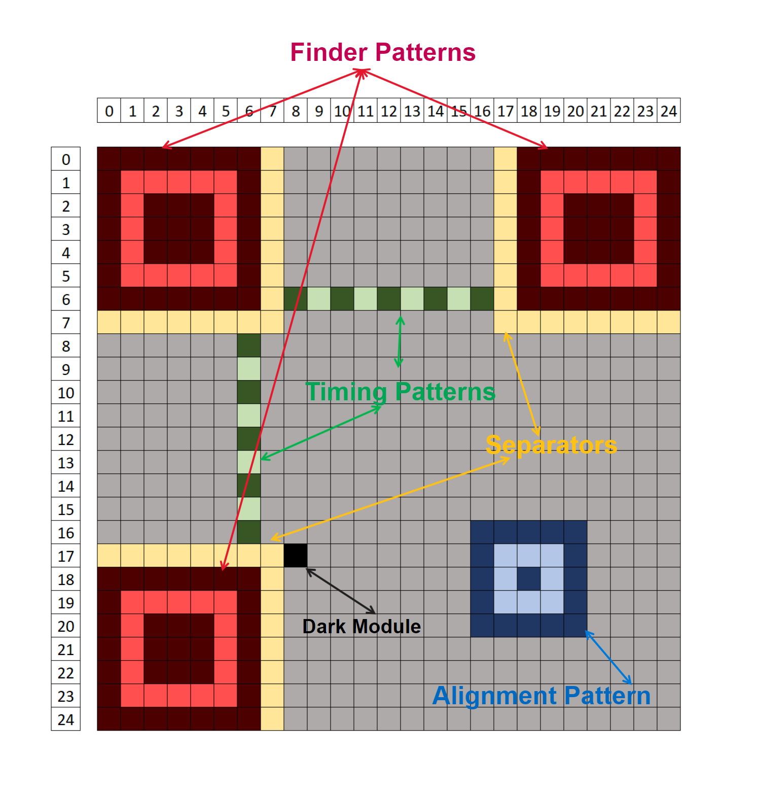
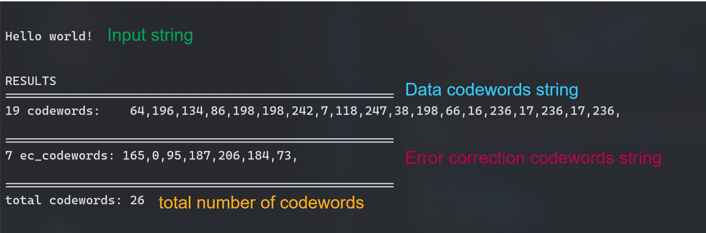

</img>
# **QR Code Generator**
by [*Daniel Ghindea*](https://github.com/Ghindea)

 The QR Code is generated as a .ppm image and its properties (version, color, error_correction and more) are all customizable. A future version of this program will focus on generating a more versatile image format (.png, .jpg, etc.). Currently the program has been tested on Linux.

## CONTENTS:

- [Configuration parametes](#configuration-parameters)
- [How it works](#how-it-works)
- [Contributors](#contributors)
- [Bibliography](#bibliography)
- [Licence](#license)

##  SYNOPSIS:
        ./project [OPTION]
###  DESCRIPTION:
        --config
                opens header file "config.h" to edit program parameters.

## CONFIGURATION PARAMETERS:

1. `version`: there are fixed configurations of QR code sizes that range from 1 to 40: 
```
        1: 21x21; can encode up to 17 ASCII characters
        2: 25x25; can encode up to 32 ASCII characters
        3: 29x29; can encode up to 53 ASCII characters
        ...
        40: 177x177; can encode up to 2953 ASCII characters
```                
Currently only the first 9 versions are implemented. For more information about character capacities see [^1]
      
2. `mask`: certain patterns in the QR code matrix can make it difficult for QR code scanners to correctly read the code. to counteract this, the QR code specification defines 8 mask patterns:
```
        0: (i + j) % 2 == 0
        1: i % 2 == 0
        2: j % 3 == 0
        3: (i + j) % 3 == 0
        4: (i/2 + j/3) % 2 == 0
        5: (i*j) % 2 + (i*j) % 3 == 0
        6: [(i*j) % 3 + i*j ] % 2 == 0
        7: [(i*j) % 3 + i + j] % 2 == 0
```
3. `error_correction`: there are 4 levels of error correction that helps QR code to stay readable even if some pixels can't be recognised by the scanner:
```
        0: level M - up to 15%
        1: level L - up to 7%
        2: level H - up to 30%
        3: level Q - up to 25% 
```
4. `data_type`: QR code can hold 4 different types of data:
```
        1: numeric              /* not implemented */
        2: alphanumeric         /* not implemented */
        3: bytes
        4: kanji                /* not implemented */
```        
5. `RGB` color of the QR code is determined by the given amount of red, green and blue color. their values range between 0 and 255.

6. `file`: string that defines output file's name.


## HOW IT WORKS:
The process of generating a QR code consists of 5 steps:

<details><summary> Step 1: apply function patterns               </summary>

- *Finder Patterns* are unique blocks of 7x7 modules used to orient the QR code in the correct position for decoding.
- *Separators* are used to distinguish the finder patterns from the rest of the QR code.
- *Timing Patterns* are used to accurately determine the size of the data grid.
- *Alignment Patterns* are used to straighten out QR Codes drawn on a curved surface. Depending of the selected QR version more or less alignment patterns can be placed.
- *Dark Module* is a single module that is always set on 1


</img>
QR code version 2
</details>
<details><summary> Step 2: encode data & place modules in matrix </summary>
<br>

**PART I**

For the beginning the input string has to be processed into a data string.
The first 4 bits of the data string represent the *Mode Indicator*

>| Mode name              | Mode Indicator |
>|------------------------|:--------------:|
>| Numeric mode           |  0001          |
>| Alphanumeric mode      |  0010          |
>| Byte mode              |  0100          |
>| Kanji mode             |  1000          |

Next, the *Character Count Indicator* needs to be added in a group of x bits, where x depends on QR code version (check [len_bit_no()](./src/step2.c)). After that, based on the selected mode, the encoded input string needs to be added. In the end, the obtained string has to be broken up into 8-bit Codewords and padded with 0s if necessary (if its length isn't a multiple of 8 more 0s are required and, if it's still too short, it will be filled with 236 and 17 until maximum capacity is reached).

---
**PART II** 

To ensure that the data is read correctly by the scanner it's required to generate error correction codewords for comparison. This process uses Reed-Solomon method for error correction. In a nutshell, it performs a polynomial division between the polynomial with coefficients made of data string elements and the generator polynomial (check Reed-Solomon documentation). The key of this process is finite field arithmetic ( GF(256) ).


</img>
Codewords obtained for "Hello world!" input in a version 1 QR code.

---
**PART III**


</details>
<details><summary> Step 3: mask the data section                 </summary></details>
<details><summary> Step 4: apply format patterns                 </summary></details>
<details><summary> Step 5: generate image based on matrix        </summary></details>
<br>


For detailed explanations on this topic check [bibliography](#bibliography).

## CONTRIBUTORS:
Thanks to [radubig](https://github.com/radubig) for fixing memory leaks and overview.

## BIBLIOGRAPHY:
- [Thonky QR code tutorial](https://www.thonky.com/qr-code-tutorial/)
- [Reed-Solomon CFC](https://en.wikiversity.org/wiki/Reed%E2%80%93Solomon_codes_for_coders)
- [Reed-Solomon EC](https://en.wikipedia.org/wiki/Reed%E2%80%93Solomon_error_correction)
- [Polinomials](https://en.wikipedia.org/wiki/Polynomial_code)

## LICENSE:
Content is published under [MIT Licence](https://en.wikipedia.org/wiki/MIT_License). For more information check [LICENSE.md](https://github.com/Ghindea/QR_code_beta/blob/master/LICENSE.md)

---
[^1]: [character capacities by version](https://www.thonky.com/qr-code-tutorial/character-capacities)
[^2]: [error correction table](https://www.thonky.com/qr-code-tutorial/error-correction-table)
