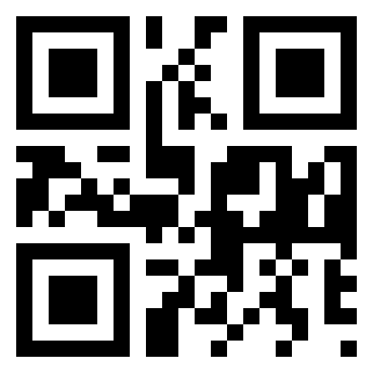

</img>
# **QR Code Generator**
by [*Daniel Ghindea*](https://github.com/Ghindea)

The QR Code is generated as a .ppm image and its properties (version, color, error_correction and more) are all customizable. A future version of this program will focus on generating a more versatile image format (.png, .jpg, etc.). Currently the program has been tested on Linux.

Check [ZXing C++](https://github.com/zxing-cpp/zxing-cpp).

To better understand how QR code is generated see the [BIBLIOGRAPHY](#bibliography).

Useful links [^2]
###  SYNOPSIS:
        ./project [OPTION]
###  DESCRIPTION:
        --config
                opens header file "config.h" to edit program parameters.
### CONFIGURATION PARAMETERS:
1. `version`: there are fixed configurations of QR code sizes that range from 1 to 40: (only the first 5 versions are currently implemented | for more information about character capacities see [^1])
```
        1: 21x21; can encode up to 17 ASCII characters
        2: 25x25; can encode up to 32 ASCII characters
        3: 29x29; can encode up to 53 ASCII characters
        ...
        40: 177x177; can encode up to 2953 ASCII characters
```                

2. `mask`: certain patterns in the QR code matrix can make it difficult for QR code scanners to correctly read the code. to counteract this, the QR code specification defines 8 mask patterns:
```
        0: (i + j) % 2 == 0
        1: i % 2 == 0
        2: j % 3 == 0
        3: (i + j) % 3 == 0
        4: (i/2 + j/3) % 2 == 0
        5: (i*j) % 2 + (i*j) % 3 == 0
        6: [(i*j) % 3 + i*j ] % 2 == 0
        7: [(i*j) % 3 + i + j] % 2 == 0
```
3. `error_correction`: there are 4 levels of error correction that helps QR code to stay readable even if some pixels can't be recognised by the scanner:
```
        0: level M - up to 15%
        1: level L - up to 7%
        2: level H - up to 30%
        3: level Q - up to 25% 
```
4. `data_type`: QR code can hold 4 different types of data:
```
        1: numeric              /* not implemented */
        2: alphanumeric         /* not implemented */
        3: bytes
        4: kanji                /* not implemented */
```        
5. `RGB` color of the QR code is determined by the given amount of red, green and blue color. their values range between 0 and 255.

6. `file`: string that defines output file's name.

### CONTRIBUTORS:
Thanks to [radubig](https://github.com/radubig) for fixing memory leaks and overview.

### BIBLIOGRAPHY:
- [Thonky QR code tutorial](https://www.thonky.com/qr-code-tutorial/)
- [Reed-Solomon EC](https://en.wikipedia.org/wiki/Reed%E2%80%93Solomon_error_correction)
- [Reed-Solomon CFC](https://en.wikiversity.org/wiki/Reed%E2%80%93Solomon_codes_for_coders)
- [James Explains QR code tutorial](https://www.youtube.com/watch?v=142TGhaTMtI&t=95s)
- [Polinomials](https://en.wikipedia.org/wiki/Polynomial_code)

### LICENSE:
Content is published under [MIT Licence](https://en.wikipedia.org/wiki/MIT_License). For more information check [LICENSE.md](https://github.com/Ghindea/QR_code_beta/blob/master/LICENSE.md)

---
[^1]: [character capacities by version](https://www.thonky.com/qr-code-tutorial/character-capacities)
[^2]: [error correction table](https://www.thonky.com/qr-code-tutorial/error-correction-table)
